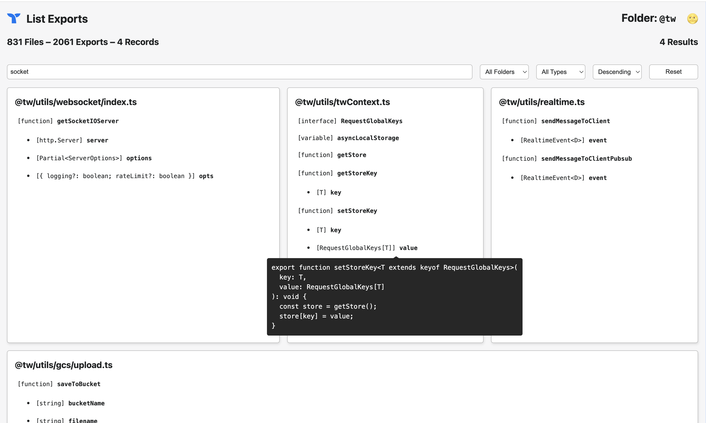

#  List Exports In A Directory

> List all exports from all JS/TS files in a directory.

Current directory is a snapshot of `@tw` utilities.

## Quick Start

```bash
yarn && yarn start
```

## Screenshots


